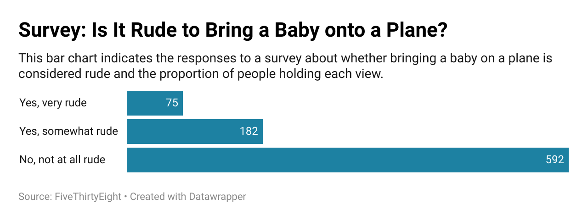

# Survey Results: Is It Rude to Bring Your Baby on a Plane?

I chose this question because it's a typically controversial topic and a relatable social dilemma given the close quarters that is unique to airplanes. Babies typically cry through plane rides due to the varying cabin pressure, which is a well-known concern. Online, I've seen varying views from individuals who are single or taken but without children, and individuals who have children, so I wanted to observe how the survey would reflect broader views on the topic and reflect a mix of empathy and frustration that passengers have while traveling. Given what I've seen online, I was expecting a mix of responses between *Yes, it's rude* and *No, it's not rude*, but there was a greater amount of people who indicated that it was not rude, which reflects the tolerance of survey respondents on something that may disrupt their travel experience.

I used a horizontal bar chart to represent the survey responses, categorizing the opinions into *Yes it's rude*, *Yes, it's somewhat rude*, and *No, it's not rude*. The chart revealed that many people are very understanding about the need for parents to travel with infants, and there was a disproportionaly high amount of people who said ***No, it's not rude***, compared to the people who answered in the other two categories.

